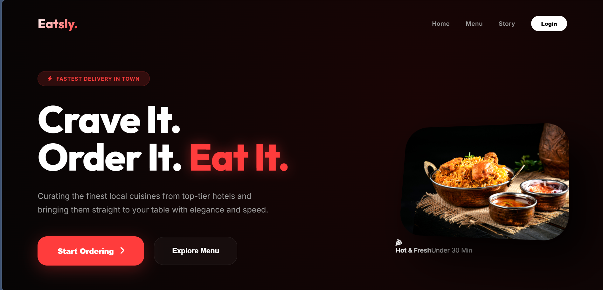
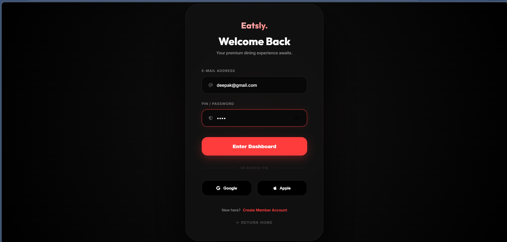
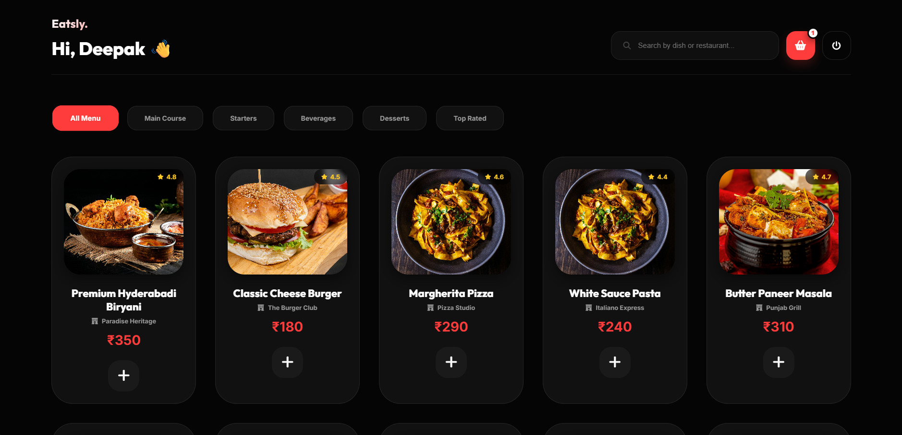
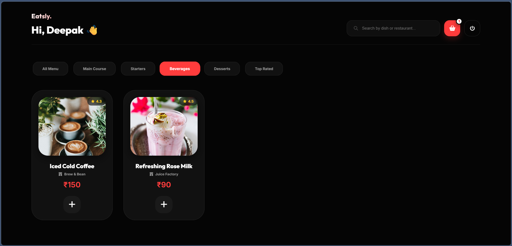
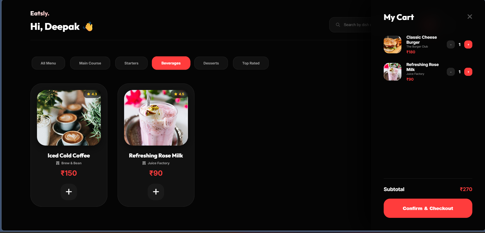
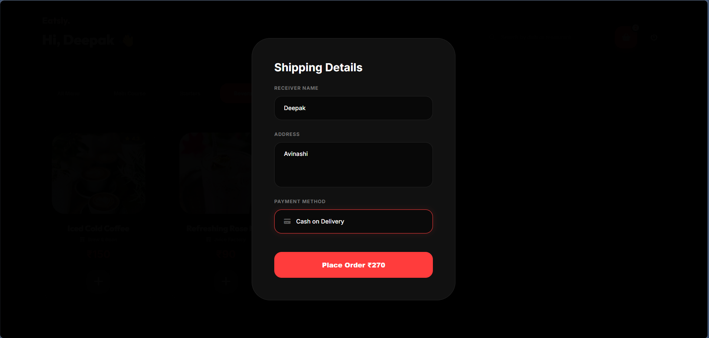
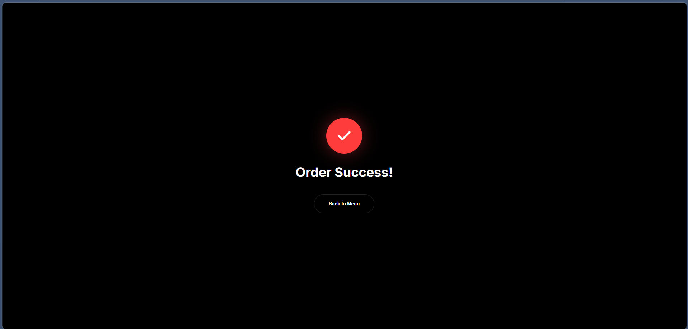

# 🍔 Food Ordering Web App

A modern dark-themed food ordering web application built using HTML, CSS, and JavaScript.

---

## 🚀 Live Demo

👉 https://github.com/DEEPAKRX2334/Food-Order-Application

---

## 📸 Application Flow Screenshots

### 🏠 Home Page

---

### 🔐 Login Page

---

### 🍽 Menu Page 1

---

### 🍽 Menu Page 2

---

### 🛒 Cart Section

---

### 💳 Payment Page

---

### ✅ Success Page

---

## ✨ Features

* Dark UI design (Dribbble inspired)
* Smooth user flow from browsing to payment
* Add to cart functionality
* Increase / decrease quantity
* Remove items from cart
* Dynamic total price calculation
* Local storage support
* Responsive design

---

## 🛠 Tech Stack

* HTML
* CSS
* JavaScript

---

## 🎯 Purpose

This project demonstrates the development of a real-world food ordering application with a focus on UI/UX design, user flow, and frontend functionality.

---

## 👨‍💻 Author

Deepak.R
